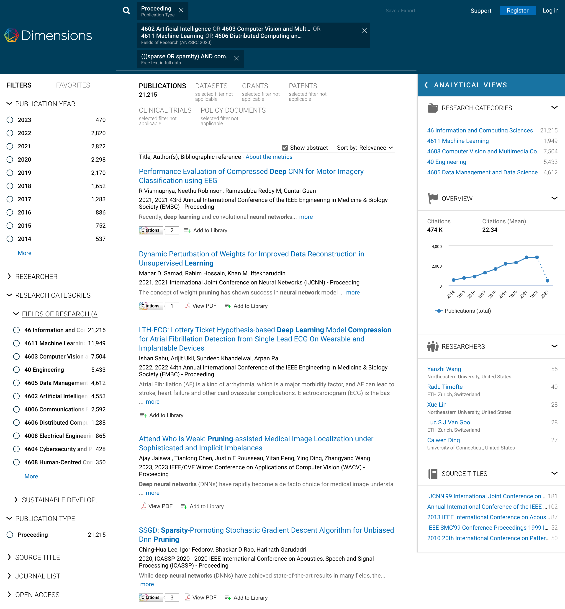

# #Publications in Network Pruning and Sparse Neural Networks

The #publications in network pruning and sparse neural networks can be obtained via this [link](https://app.dimensions.ai/discover/publication?search_mode=content&search_text=(((sparse%20OR%20sparsity)%20AND%20compression)%20OR%20pruning)%20AND%20((neural%20network)%20OR%20(Deep%20Learning))&search_type=kws&search_field=full_search&or_facet_publication_type=proceeding&or_facet_for=80181&or_facet_for=80182&or_facet_for=80190&or_facet_for=80185). Clicking on the "More" option in the publication year filter on the left of the page, we can get the specific #publication per year since 1967.

Specifically, we 
  - search in full data with condition: ``(((sparse OR sparsity) AND compression) OR pruning) AND ((neural network) OR (deep learning))``
  - filter the results by limiting the fields of research to ``4602 Artificial Intelligence OR 4603 Computer Vision and Multimedia Computation OR 4611 Machine Learning OR 4606 Distributed Computing and System Software``
  - filter the results by limiting the publication type to ``Proceeding``

Here is the screenshot of the website.

